# Équipement

L'équipement est tout ce qu'un personnage emporte : ce qu'il porte sur lui, ce qu'il range dans son sac, ce qu'il boit et ce qu'il mange. Chaque objet tient dans une carte qui donne son poids, son prix et ce qu'il fait.

### Lire une carte d'objet

**La capacité :** le nombre de doses que l'objet peut contenir, ou de parts qu'on en tire quand c'est lui qu'on entame. Un objet qui sert une fois et disparaît n'en porte pas.

**Le poids à vide :** ce que l'objet pèse en kilogrammes une fois vidé, à compter dans la [charge](base/capacites-physiques.md#la-charge) du personnage.

**Le poids par dose :** ce que chaque dose ajoute à ce poids. Un objet plein pèse donc son poids à vide plus autant de fois ce nombre qu'il lui reste de doses.

**Le poids :** ce que pèse en kilogrammes un objet qui ne se remplit pas. Il tient la place des deux lignes précédentes.

**Le poids par part :** ce que pèse chaque part d'un objet qui s'entame sans être un contenant. Une miche entamée pèse ce qui lui reste.

**La satiété** et **l'hydratation :** ce qu'une dose rend de faim et de soif, en points.

**Les places :** ce qu'une dose ou une part occupe de [contenance](base/capacites-physiques.md#la-contenance) une fois avalée.

**L'achat :** ce qu'un marchand en demande, en pièces d'argent. Un prix suivi de *les dix* ou *les vingt* se paie au lot, et l'on n'en achète pas moins : une pincée de cendre ne se vend pas, un sac oui. Un tiret veut dire qu'aucun marchand n'en tient. La part de pain est l'étalon du livre, et une pièce d'argent en achète une.

**La vente :** ce qu'un marchand en donne, en pièces d'argent. Elle vaut le tiers de l'achat, arrondi vers le bas, et se compte sur le lot entier : trois pains valent une pièce là où un seul n'en vaut aucune. Un tiret veut dire qu'un objet seul ne se revend pas.

**Le type :** ce que l'objet est. Un objet n'en porte qu'un. Un **outil** ne se consomme pas et ne s'use pas : on l'a ou on ne l'a pas. Une **arme** ne porte ici que son poids et son prix, et les coups qu'elle donne se lisent au chapitre des [armes](combat/armes.md). Une **matière** ne s'emploie pas telle quelle : elle attend l'atelier.

**La description :** ce à quoi l'objet ressemble et ce à quoi il sert. Elle ne porte aucune règle.

**Les propriétés :** ce que l'objet fait de particulier. Chacune vient après la description, son nom en tête, suivi de ce qu'elle est puis de ce qu'elle change. Un objet ordinaire n'en porte aucune.

Deux effets qui portent le même nom ne se cumulent pas, à moins que leur règle ne le dise. Le second efface le premier et en relance la durée.

### Se servir d'un objet

Boire ou manger coûte un [dé d'action](base/actions.md#les-des-daction). Prendre l'objet en main en coûte un second, à moins qu'il ne tienne dans un [accès rapide](base/capacites-physiques.md#les-acces-rapides), où il est déjà.

Se servir d'un consommable tiré du sac revient donc à deux dés d'action, et à un seul quand il est sous la main.

C'est la [contenance](base/capacites-physiques.md#la-contenance) qui borne ce qu'un personnage avale, dans un round comme dans une journée.

Un contenant se remplit à une source et se vide par doses : ce qu'une dose verse est le volume du contenant divisé par son nombre de doses. Ce qui n'est pas liquide se compte autrement, une dose y valant une unité de ce qu'on y range et non une gorgée. Remplir un contenant à une source demande une minute d'[effort léger](base/capacites-physiques.md#leffort).

**Un contenant ne prend que ce que son type nomme.** Les liquides vont à la gourde, à la bouteille et à la fiole ; les poudres à la poche ; ce qui poisse et ce qui graisse au pot, car ni le cuir ni le col étroit ne s'en relaveraient.

Un litre d'eau bu rend 80 points d'[hydratation](base/capacites-physiques.md#la-satiete-et-lhydratation) et occupe 8 places de contenance ; une dose en rend et en occupe sa part, soit 20 points et 2 places pour un quart de litre. Une journée de marche coûte 135 points de [satiété](base/capacites-physiques.md#la-satiete-et-lhydratation), soit trois parts de pain.

---

## Les contenants { .cat }

**Gourde en cuir**

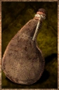{ .objet-img }

Capacité8

Poids à vide0.25 kg

Poids par dose0.25 kg

Achat6

Vente2

TypeContenant à liquide

Une outre de cuir cousu et poissé, fermée d'un bouchon de bois et portée en bandoulière, qui peut contenir jusqu'à deux litres. Elle est généralement utilisée par les voyageurs et les aventuriers pour emporter de l'eau.

**Boire.** Un [dé d'action](base/actions.md#les-des-daction) permet soit de boire une dose, soit de la faire boire à quelqu'un qui y consent ou qui est hors d'état d'agir.

**Bouteille en verre**

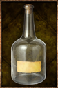{ .objet-img }

Capacité4

Poids à vide0.5 kg

Poids par dose0.25 kg

Achat18

Vente6

TypeContenant à liquide

Une bouteille de verre soufflé vert, au col étroit fermé d'un bouchon de liège et portant une étiquette de papier, qui peut contenir jusqu'à un litre. On la trouve souvent pleine d'un bon vin de gabaie.

**Boire.** Un [dé d'action](base/actions.md#les-des-daction) permet soit de boire une dose, soit de la faire boire à quelqu'un qui y consent ou qui est hors d'état d'agir.

**Bouteille en verre bleuté**

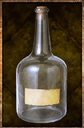{ .objet-img }

Capacité4

Poids à vide0.5 kg

Poids par dose0.25 kg

Achat27

Vente9

TypeContenant à liquide

Une bouteille de verre bleuté, au col étroit fermé d'un bouchon de liège et portant une étiquette de papier, qui peut contenir jusqu'à un litre. On ne la voit guère ailleurs que sur les étagères d'un alchimiste.

**Boire.** Un [dé d'action](base/actions.md#les-des-daction) permet soit de boire une dose, soit de la faire boire à quelqu'un qui y consent ou qui est hors d'état d'agir.

**Conservation.** Cette bouteille garde intact ce qu'on lui confie. Un liquide magique n'y périme pas.

**Fiole en verre**

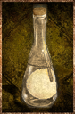{ .objet-img }

Capacité1

Poids à vide0.25 kg

Poids par dose0.25 kg

Achat12

Vente4

TypeContenant à liquide

Une petite fiole de verre commun au col effilé, bouchée de liège et liée d'une ficelle portant une étiquette de papier vierge, qui peut contenir jusqu'à un quart de litre. On la trouve souvent pleine d'une huile ou d'un remède commun.

**Boire.** Un [dé d'action](base/actions.md#les-des-daction) permet soit de boire une dose, soit de la faire boire à quelqu'un qui y consent ou qui est hors d'état d'agir.

**Fiole en verre bleuté**

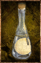{ .objet-img }

Capacité1

Poids à vide0.25 kg

Poids par dose0.25 kg

Achat18

Vente6

TypeContenant à liquide

Une petite fiole de verre bleuté au col effilé, bouchée de liège et liée d'une ficelle portant une étiquette de papier vierge, qui peut contenir jusqu'à un quart de litre. C'est en elle que les alchimistes vendent leurs préparations.

**Boire.** Un [dé d'action](base/actions.md#les-des-daction) permet soit de boire une dose, soit de la faire boire à quelqu'un qui y consent ou qui est hors d'état d'agir.

**Conservation.** Cette fiole garde intact ce qu'on lui confie. Un liquide magique n'y périme pas.

**Poche**

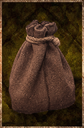{ .objet-img }

Capacité10

Poids à vide0.1 kg

Poids par dose0.1 kg

Achat6

Vente2

TypeContenant à poudre

Une bourse de cuir souple fermée d'un cordon, qui tient dans la paume et se porte à la ceinture. Artisans et ramasseurs y mettent leurs poudres et tout ce qui file entre les doigts.

**Pot en verre**

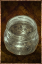{ .objet-img }

Capacité4

Poids à vide0.25 kg

Poids par dose0.1 kg

Achat12

Vente4

TypeContenant à pâte

Un pot de verre soufflé vert, trapu et à large gueule, fermé d'un disque de bois et d'un lien, qui peut contenir près d'un demi-litre. On y garde la poix, le suif et les confitures.

**Pot en verre bleuté**

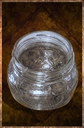{ .objet-img }

Capacité4

Poids à vide0.25 kg

Poids par dose0.1 kg

Achat18

Vente6

TypeContenant à pâte

Un pot de verre bleuté à large gueule, scellé d'un disque de bois et d'un lien de cire, qui peut contenir près d'un demi-litre. Les apothicaires y tiennent leurs onguents.

**Conservation.** Ce pot garde intact ce qu'on lui confie. Un onguent magique n'y périme pas.

---

## Les liquides { .cat }

**Eau potable**

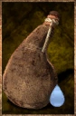{ .objet-img }

Hydratation20

Places2

Achat—

Vente—

TypeLiquide

Une eau claire et sans odeur, tirée d'une source, d'une fontaine ou d'un puits. C'est celle dont on remplit les gourdes avant de prendre la route.

**Souffle.** Chaque dose bue élève d'un niveau la [récupération naturelle](base/capacites-physiques.md#la-recuperation-naturelle) des points d'endurance pendant dix minutes.

**Eau de rivière**

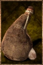{ .objet-img }

Hydratation20

Places2

Achat—

Vente—

TypeLiquide

L'eau trouble des cours d'eau et des mares, prise telle qu'elle vient. On la boit quand la gourde est vide et la source encore loin, et on la fait bouillir quand on en a le temps.

**Souffle.** Chaque dose bue élève d'un niveau la [récupération naturelle](base/capacites-physiques.md#la-recuperation-naturelle) des points d'endurance pendant dix minutes.

**Indigestion.** Cette eau n'est pas potable. Lorsqu'un personnage en boit une dose, le MJ doit lancer en secret 2d8. Si leur somme est inférieure ou égale à 4, le personnage attrape une indigestion.

**Eau salée**

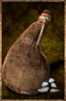{ .objet-img }

Hydratationaucune

Places2

Achat—

Vente—

TypeLiquide

L'eau limpide et amère de la mer et des marais salants. Les cuisiniers la recueillent pour le sel qu'elle laisse en s'évaporant ; personne ne la boit.

**Indigestion.** Cette eau n'est pas potable. Lorsqu'un personnage en boit une dose, le MJ doit lancer en secret 2d8. Si leur somme est inférieure ou égale à 9, le personnage attrape une indigestion.

**Eau rance**

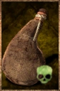{ .objet-img }

Hydratation20

Places2

Achat—

Vente—

TypeLiquide

L'eau croupie des flaques, des citernes crevées et des fonds de cave, trouble et malodorante. Il faut être aux abois pour y tremper les lèvres, et un feu suffit à la racheter.

**Souffle.** Chaque dose bue élève d'un niveau la [récupération naturelle](base/capacites-physiques.md#la-recuperation-naturelle) des points d'endurance pendant dix minutes.

**Indigestion.** Cette eau n'est pas potable. Lorsqu'un personnage en boit une dose, le MJ doit lancer en secret 2d8. Si leur somme est inférieure ou égale à 11, le personnage attrape une indigestion.

---

## Les poudres { .cat }

**Sable**

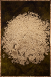{ .objet-img }

Poids0.1 kg

Achat1 les 10

Vente—

TypePoudre

Du sable pâle et fin, lavé et séché, pris au bord d'une rivière ou sur une plage. Les verriers s'en servent pour faire le verre.

**Sable bleu**

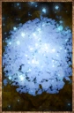{ .objet-img }

Poids0.1 kg

Achat12

Vente4

TypePoudre

Une poudre bleue et scintillante qui affleure sur certaines plages. Les forgerons en tirent l'acier bleu, et les alchimistes la prisent fort.

**Lueur.** Ce sable brille dans le noir comme de petites lucioles bleues. Un gisement se repère de loin la nuit.

**Cendre**

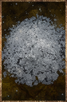{ .objet-img }

Poids0.1 kg

Achat1 les 20

Vente—

TypePoudre

La poudre grise qu'un feu de bois laisse derrière lui, tamisée de ses braises et de ses charbons. Les paysans en amendent leurs terres.

**Farine**

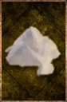{ .objet-img }

Poids0.1 kg

Achat2 les 10

Vente—

TypePoudre

Une farine blanche et fine, sortie du bluteau et encore tiède de la meule. Le meunier la vend au sac de dix, et il en faut six pour une miche.

---

## Les pâtes { .cat }

**Poix**

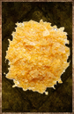{ .objet-img }

Poids0.1 kg

Achat—

Vente—

TypePâte

Des écailles de résine de pin, ambrées et cassantes à froid, qui coulent dès qu'on les approche du feu. Les maroquiniers en tapissent l'intérieur des gourdes.

**Graisse**

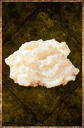{ .objet-img }

Poids0.1 kg

Achat—

Vente—

TypePâte

Du suif fondu puis battu jusqu'à blanchir, ferme et gras sous le doigt. Les tanneurs en nourrissent le cuir au sortir de la fosse.

---

## Les vivres { .cat }

**Pain**

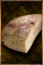{ .objet-img }

Capacité5

Satiété45

Places8

Poids par part0.2 kg

Achat5

Vente1

TypeAliment

Une miche de pain bis à la croûte farinée, cuite le matin même, qu'on rompt en cinq parts. On en trouve sur toutes les tables et dans tous les sacs.

---

## Les outils { .cat }

**Pelle**

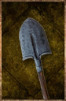{ .objet-img }

Poids2 kg

Achat12

Vente4

TypeOutil

Un fer de pelle emmanché sur un long manche de frêne, poli par les mains. Les charbonniers s'en servent pour couvrir leurs meules de terre.

---

## Les armes { .cat }

**Épée en fer**

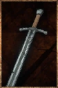{ .objet-img }

Poids1.2 kg

Achat288

Vente96

TypeArme

Une lame droite de quatre-vingts centimètres, montée sur une croix de fer et une poignée de bois cerclée de cuir. Elle vaut le prix de huit charretées de charbon, et c'est du charbon qu'elle sort.

---

## Les matières { .cat }

**Verre cassé**

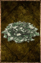{ .objet-img }

Poids0.1 kg

Achat—

Vente—

TypePoudre

Des tessons de fioles et de bouteilles, ramassés au balai et concassés au pilon. Les verriers les refondent avec le sable.

**Casse.** Une fiole brisée donne deux verres cassés, une bouteille quatre, un pot deux.

**Verre cassé bleuté**

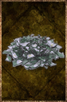{ .objet-img }

Poids0.1 kg

Achat—

Vente—

TypePoudre

Des tessons de verre bleuté, mis de côté dans un seau à part. Un verrier ne les mêle jamais au calcin commun : le bleu s'y perdrait pour rien.

**Casse.** Une fiole bleutée brisée donne deux verres cassés bleutés, une bouteille quatre, un pot deux.

**Petit bois**

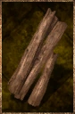{ .objet-img }

Poids0.3 kg

Achat—

Vente—

TypeComposant

Des branches mortes ramassées au sol et fendues à la main, sèches et prêtes à prendre. Il nourrit les feux de camp.

**Bûche**

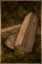{ .objet-img }

Poids3 kg

Achat—

Vente—

TypeComposant

Une bûche de bois dur fendue en quartier, longue comme l'avant-bras. On l'ajoute au feu quand le petit bois a pris.

**Demi-stère de bois**

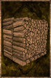{ .objet-img }

Poids300 kg

Achat9

Vente3

TypeComposant

Un demi-stère de bûches d'un mètre, fendues et empilées en tas carré, plus lourd qu'un homme n'en porte. C'est le bois des fours et des forges.

**Charbon de bois**

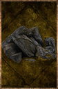{ .objet-img }

Poids0.5 kg

Achat1

Vente—

TypeComposant

Un charbon noir et léger, tiré d'une bûche cuite à l'étouffée. Il donne un feu vif et sans fumée, que les forgerons préfèrent au bois.

**Charretée de charbon**

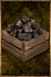{ .objet-img }

Poids50 kg

Achat36

Vente12

TypeComposant

Le charbon d'une meule entière, livré au tas. C'est ce que dévorent les bas fourneaux et les forges, qui n'en brûlent jamais moins.

**Minerai de fer**

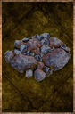{ .objet-img }

Poids2 kg

Achat—

Vente—

TypeComposant

Une roche grise et rouillée, piquée d'éclats métalliques, tirée du filon et cassée à la masse. Il en faut huit kilos pour deux kilos de fer, et le reste part en scorie.

**Lingot de fer**

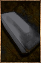{ .objet-img }

Poids2 kg

Achat42

Vente14

TypeComposant

Un lingot de fer cinglé, sombre et piqué de scories. C'est sous cette forme que le métal se vend, se transporte et se remet au feu.

**Gerbe de blé**

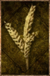{ .objet-img }

Poids12 kg

Achat1

Vente—

TypeComposant

Une brassée d'épis coupés à la faucille et liés d'un lien de paille, dressée en tas au bord du champ. Le grain y tient encore à l'épi.

**Petite peau de bête**

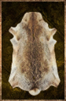{ .objet-img }

Poids0.5 kg

Achat1

Vente—

TypeComposant

Une peau de lièvre ou de renard, tendue sur son cadre et séchée le poil au-dehors. Sa fourrure borde les capuchons et les cols.

**Peau de bête**

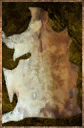{ .objet-img }

Poids2 kg

Achat3

Vente1

TypeComposant

Une peau de loup ou de hyène, raclée de sa chair et roulée en ballot. Les tanneurs l'utilisent pour en faire du cuir.

**Grande peau de bête**

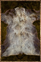{ .objet-img }

Poids8 kg

Achat6

Vente2

TypeComposant

La peau d'un ours ou d'un bovin, épaisse au toucher et raide une fois sèche. Une seule suffit à couvrir un homme.

**Petit cuir**

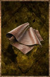{ .objet-img }

Poids0.15 kg

Achat6

Vente2

TypeComposant

Un carré de cuir souple, large comme une main ouverte, roulé et lié d'une ficelle. Les maroquiniers s'en servent pour fabriquer des bourses et des gants.

**Cuir**

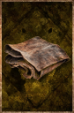{ .objet-img }

Poids0.6 kg

Achat12

Vente4

TypeComposant

Une pièce de cuir tanné, souple et sombre, pliée en quatre. On y coupe deux gourdes, ou une paire de bottes.

**Grand cuir**

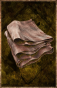{ .objet-img }

Poids2.4 kg

Achat24

Vente8

TypeComposant

Un pan de cuir d'un seul tenant, dont les bords pendent quand on le lève. Il faut cette taille pour un sac de voyage ou un plastron.

